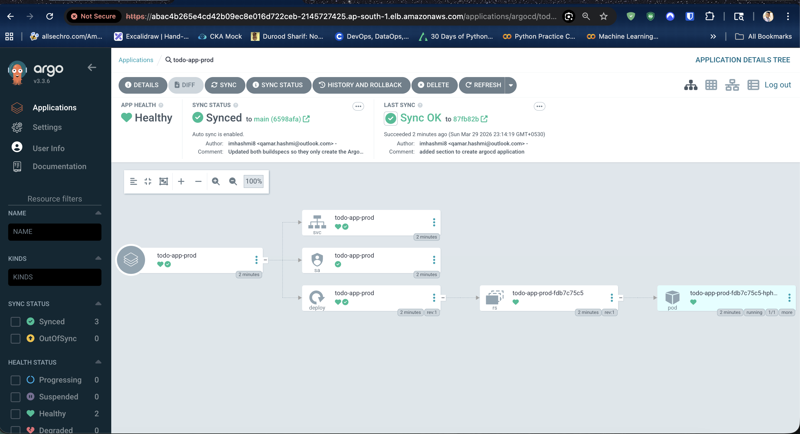
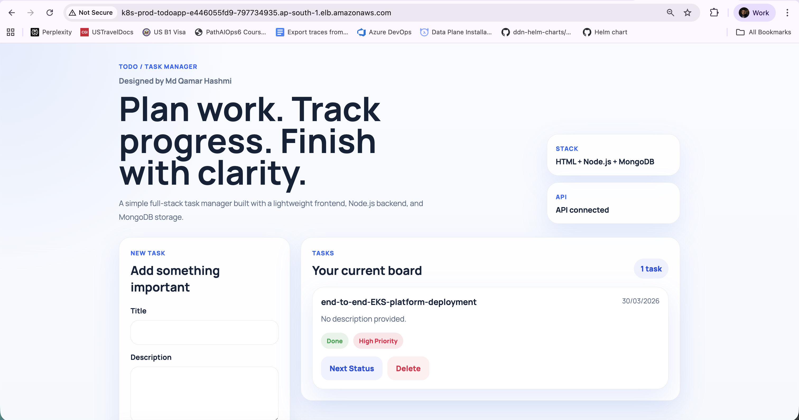
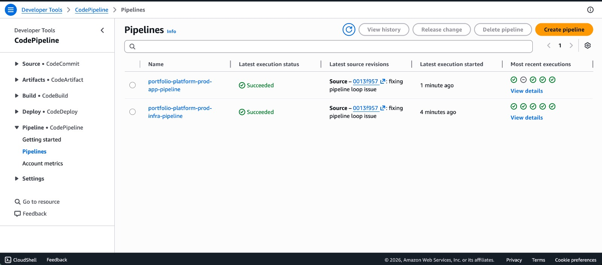

# End-to-End EKS Platform Engineering System

This repository is my platform engineering portfolio project built on AWS. It demonstrates how I provision infrastructure with Terraform, package an application with Helm, run CI with AWS CodePipeline and CodeBuild, publish images to Amazon ECR, and deliver workloads to Amazon EKS through Argo CD and GitOps.

The project is designed to show an end-to-end operating model rather than an isolated demo:

- infrastructure and application delivery are split into separate pipelines
- application images are versioned and pushed to ECR
- GitOps values are updated automatically after each successful image build
- Argo CD reconciles the desired state into Kubernetes
- dev and prod environments are managed independently

## Live Project Views

### Argo CD Sync View



### Production Todo Application



### AWS CodePipeline Overview



## What This Project Covers

- Terraform modules for VPC, EKS, ECR, and CI/CD
- separate AWS CodePipeline pipelines for app delivery and infrastructure delivery
- CodeBuild jobs for Docker image build, ECR push, and Terraform apply
- Helm-based Kubernetes packaging
- Argo CD `Application` manifests for GitOps deployment
- environment-specific GitOps values for dev and prod
- MongoDB Atlas integration through Kubernetes secrets

## Architecture

```text
GitHub Repository
   |
   |-- changes under apps/todo-app/** or helm/todo-app/**
   |      -> App Pipeline
   |      -> CodeBuild builds Docker image
   |      -> Image pushed to Amazon ECR
   |      -> CodeBuild updates gitops/<env>/values.yaml
   |      -> Commit pushed back to GitHub
   |      -> Argo CD detects the new desired state
   |      -> EKS deploys the new version
   |
   |-- changes under terraform/**
          -> Infra Pipeline
          -> CodeBuild runs Terraform
          -> AWS infrastructure is created or updated
          -> Argo CD is bootstrapped if missing
          -> Argo CD Application is created if missing
```

Application runtime flow:

```text
User -> Load Balancer / Kubernetes Service -> Todo App -> MongoDB Atlas
```

Detailed platform flow:

```text
                GitHub Repo
                     |
     ---------------------------------
     |                               |
 App Pipeline                 Infra Pipeline
     |                               |
 CodeBuild (Docker)         CodeBuild (Terraform)
     |                               |
     v                               v
   Amazon ECR               AWS Infrastructure
     |                      (VPC, EKS, IAM, etc.)
     |                               |
     -----------+---------------------
                 |
           GitOps Repo Update
                 |
              Argo CD
                 |
              Amazon EKS
                 |
        Kubernetes (Helm)
                 |
           Todo App Pods
                 |
           MongoDB Atlas
```

## Repository Structure

```text
.
├── apps/
│   └── todo-app/
│       ├── Dockerfile
│       ├── buildspec-dev.yml
│       ├── buildspec-prod.yml
│       └── ...
├── docs/
│   └── images/
├── gitops/
│   ├── dev/
│   │   ├── application.yaml
│   │   └── values.yaml
│   └── prod/
│       ├── application.yaml
│       └── values.yaml
├── helm/
│   └── todo-app/
│       ├── templates/
│       └── values.yaml
├── terraform/
│   ├── buildspec-dev.yml
│   ├── buildspec-prod.yml
│   ├── envs/
│   │   ├── dev/
│   │   └── prod/
│   └── modules/
│       ├── cicd/
│       ├── ecr/
│       ├── eks/
│       └── vpc/
└── README.md
```

## Core Components

### 1. Infrastructure as Code

Terraform is used to provision:

- VPC with public and private subnets
- Amazon EKS clusters for dev and prod
- Amazon ECR repositories
- S3 artifact storage for pipelines
- CodeBuild projects
- CodePipeline pipelines
- IAM roles and policies needed by CI/CD

The infrastructure is organized into reusable modules under `terraform/modules` and environment-specific entry points under `terraform/envs/dev` and `terraform/envs/prod`.

### 2. Application Delivery Pipeline

The app pipeline is triggered for changes under:

- `apps/todo-app/**`
- `helm/todo-app/**`

The flow is:

1. CodePipeline pulls the source from GitHub through CodeStar Connection.
2. CodeBuild installs dependencies and builds the Docker image.
3. The image is tagged with an environment-aware tag such as `prod-<build-number>-<short-sha>`.
4. The image is pushed to Amazon ECR.
5. CodeBuild clones the GitHub repository with a GitHub token stored in AWS Secrets Manager.
6. It updates `gitops/dev/values.yaml` or `gitops/prod/values.yaml` with the new image tag.
7. It commits that change back to the repository.
8. Argo CD detects the updated desired state and syncs the workload.

This approach avoids direct `kubectl set image` style deployments and keeps Git as the source of truth.

### 3. Infrastructure Delivery Pipeline

The infra pipeline is triggered only for:

- `terraform/**`

The flow is:

1. CodePipeline starts the infra CodeBuild job.
2. CodeBuild runs `terraform init`, `validate`, `plan`, and `apply`.
3. It updates kubeconfig for the correct EKS cluster.
4. It bootstraps Argo CD if the namespace does not already exist.
5. It waits for the `Application` CRD and creates the environment-specific Argo CD application if it is missing.
6. It installs the AWS Load Balancer Controller.

Keeping infrastructure and app delivery separate helps avoid noisy coupling between runtime deployments and platform changes.

### 4. GitOps with Argo CD

Argo CD is configured through environment-specific `Application` manifests:

- `gitops/dev/application.yaml`
- `gitops/prod/application.yaml`

Each application points to:

- repo: this repository
- chart path: `helm/todo-app`
- values file: environment-specific file under `gitops/dev` or `gitops/prod`

Automated sync is enabled with:

- `prune: true`
- `selfHeal: true`

That means Argo CD continuously reconciles the cluster back to the state stored in Git.

### 5. Helm Packaging

The workload is packaged as a Helm chart in `helm/todo-app`.

The chart manages:

- Deployment
- Service
- Ingress template
- HorizontalPodAutoscaler
- ServiceAccount
- environment variables
- secret-based environment variable injection

The application-specific runtime configuration lives in:

- `gitops/dev/values.yaml`
- `gitops/prod/values.yaml`

## End-to-End Setup

### Prerequisites

Before running this project, you should have:

- an AWS account
- a GitHub repository for the source code
- AWS CLI configured locally
- Terraform installed locally if you want to run the stack outside CodeBuild
- `kubectl`, `helm`, and `eksctl`
- a MongoDB Atlas cluster and connection string
- an AWS CodeStar Connection linked to GitHub

### 1. Configure Terraform Environment Variables

Update the environment-specific tfvars files:

- `terraform/envs/dev/terraform.tfvars`
- `terraform/envs/prod/terraform.tfvars`

Important values include:

- `github_owner`
- `github_repo`
- `github_branch`
- `codestar_connection_arn`
- `ecr_repository_name`
- `cicd_artifact_bucket_name`
- AWS profile and region values

### 2. Create the GitHub Token Secret in AWS Secrets Manager

The app buildspecs read the GitHub token from:

- secret name: `github/cicd`
- JSON key: `token`

Example:

```bash
aws secretsmanager create-secret \
  --region ap-south-1 \
  --name github/cicd \
  --secret-string '{"token":"YOUR_GITHUB_PAT"}'
```

This token is used by CodeBuild to push GitOps value updates back to the repository.

### 3. Create the MongoDB Kubernetes Secret

The application expects a Kubernetes secret named `mongo-secret` with key `MONGO_URI`.

Example:

```bash
kubectl create namespace prod --dry-run=client -o yaml | kubectl apply -f -
kubectl create secret generic mongo-secret \
  -n prod \
  --from-literal=MONGO_URI='your-mongodb-atlas-connection-string'
```

For dev:

```bash
kubectl create namespace dev --dry-run=client -o yaml | kubectl apply -f -
kubectl create secret generic mongo-secret \
  -n dev \
  --from-literal=MONGO_URI='your-mongodb-atlas-connection-string'
```

### 4. Provision Infrastructure

You can provision locally:

```bash
cd terraform/envs/prod
terraform init -reconfigure
terraform plan -var-file=terraform.tfvars
terraform apply -var-file=terraform.tfvars
```

Or let the infra pipeline manage changes automatically when code under `terraform/` changes.

### 5. Let the App Pipeline Deliver New Versions

Once the infrastructure is in place:

1. push an app or Helm change
2. the app pipeline builds and pushes a new image
3. GitOps values are updated automatically
4. Argo CD syncs the change into the cluster

## How Image Updates Work

The image promotion pattern in this repository is:

1. build a new Docker image
2. push it to ECR
3. update the environment-specific GitOps values file
4. commit the new tag back into Git
5. let Argo CD deploy it

This is important because the deployment is driven by Git state, not by a direct imperative command from CI.

## Deployment Files That Matter Most

### App Buildspecs

- `apps/todo-app/buildspec-dev.yml`
- `apps/todo-app/buildspec-prod.yml`

These handle:

- Docker build
- ECR push
- GitOps values update
- commit back to GitHub

### Infra Buildspecs

- `terraform/buildspec-dev.yml`
- `terraform/buildspec-prod.yml`

These handle:

- Terraform apply
- Argo CD bootstrap
- Argo CD `Application` creation when missing
- AWS Load Balancer Controller installation

### GitOps Manifests

- `gitops/dev/application.yaml`
- `gitops/prod/application.yaml`
- `gitops/dev/values.yaml`
- `gitops/prod/values.yaml`

## Why This Is a Good Platform Engineering Portfolio Project

This repository demonstrates practical skills across several layers:

- designing modular Terraform for repeatable infrastructure
- separating app and infra delivery concerns
- building event-driven AWS pipelines
- using ECR as a deployment artifact store
- packaging Kubernetes resources with Helm
- implementing GitOps with Argo CD
- handling secrets outside Git
- working across dev and prod environments
- debugging real CI/CD issues such as source ZIP behavior, trigger loops, and Argo CD bootstrap

## Security and Operational Notes

- MongoDB credentials are not stored in Git.
- The GitHub token used for GitOps updates is stored in AWS Secrets Manager.
- Argo CD is bootstrapped automatically, but access hardening should be reviewed for production use.
- The EKS API endpoint is currently configured for broad public access in the tfvars for ease of portfolio testing. In a production-grade setup, this should be restricted to trusted CIDRs.

## Useful Commands

Terraform:

```bash
cd terraform/envs/dev
terraform init -reconfigure
terraform validate
terraform plan -var-file=terraform.tfvars
terraform apply -var-file=terraform.tfvars
```

Helm:

```bash
helm lint helm/todo-app
helm template todo-app helm/todo-app -f gitops/prod/values.yaml
```

Kubernetes:

```bash
kubectl get applications -n argocd
kubectl get pods -n prod
kubectl get svc -n prod
kubectl logs -n prod deploy/todo-app-prod
```

Argo CD initial admin password:

```bash
kubectl -n argocd get secret argocd-initial-admin-secret \
  -o jsonpath="{.data.password}" | base64 --decode && echo
```

## Future Improvements

- add monitoring with Prometheus and Grafana
- add SLOs and alerting
- tighten IAM permissions further
- add automated TLS and DNS management for public endpoints
- add policy enforcement and admission controls
- add progressive delivery strategies

## Summary

This project shows how I approach platform engineering as a connected system: infrastructure, pipelines, container delivery, Kubernetes packaging, GitOps reconciliation, and operational setup all working together. It is intentionally built as a portfolio project that demonstrates not only happy-path deployment, but also the kind of practical debugging and workflow refinement that real platform work requires.
